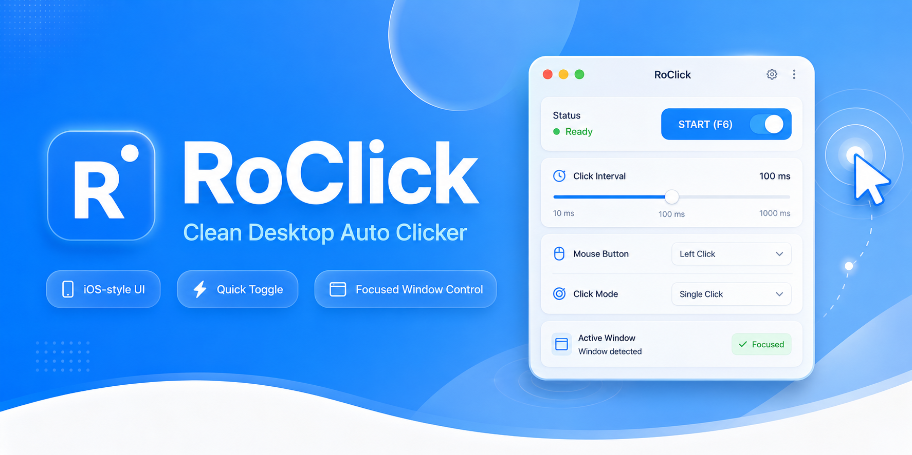
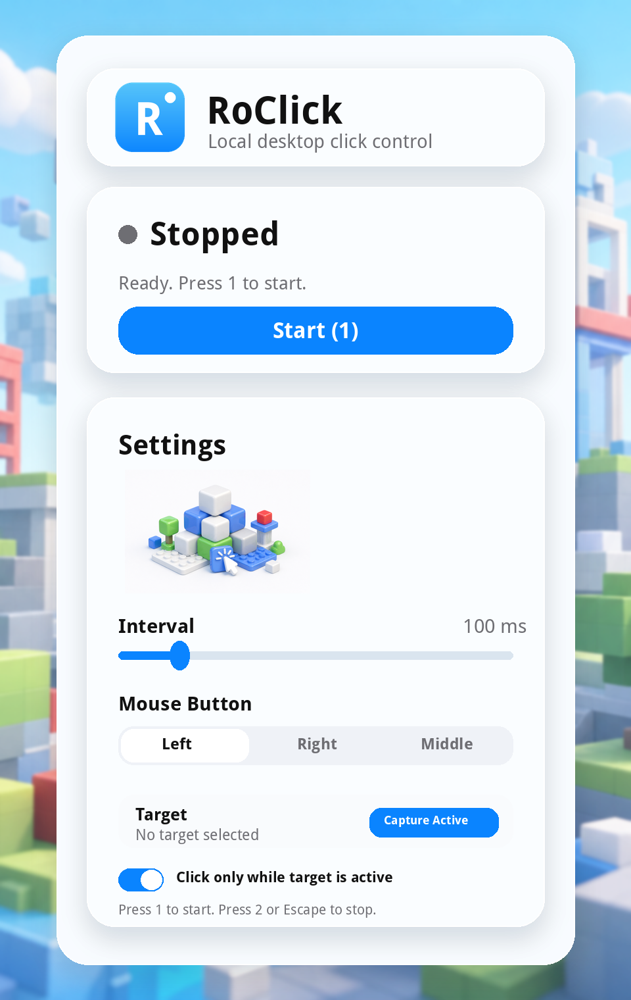

# RoClick

RoClick is a lightweight Windows desktop auto-clicker with a clean, iOS-inspired interface. It repeatedly sends ordinary mouse clicks at a user-selected interval and can restrict clicking to one captured foreground window.



## What it is for

RoClick is intended for accessibility workflows, repetitive desktop tasks, interface testing, personal automation, and private QA environments where automated clicking is permitted. It is not designed to bypass anti-cheat systems, automate competitive online gameplay, read process memory, inject code, or avoid platform restrictions.

## Features

- Minimal iOS-style desktop interface
- Frosted-glass inspired layered background
- Original Roblox-inspired blocky visual assets, with no official Roblox artwork
- Global **F6** start/stop hotkey
- **Escape** emergency stop
- 50-1000 ms click interval
- Left, right, and middle click modes
- Foreground-window capture
- Optional target-window focus lock
- Local-only operation with no telemetry
- Reproducible Windows EXE build through GitHub Actions

## Downloads

| Version | Windows EXE | SHA-256 |
| --- | --- | --- |
| v0.2.1 | [RoClick.exe](https://github.com/0xMasharipov/RoClick/releases/download/v0.2.1/RoClick.exe) | [RoClick.sha256.txt](https://github.com/0xMasharipov/RoClick/releases/download/v0.2.1/RoClick.sha256.txt) |
| v0.2.0 | [RoClick.exe](https://github.com/0xMasharipov/RoClick/releases/download/v0.2.0/RoClick.exe) | [RoClick.sha256.txt](https://github.com/0xMasharipov/RoClick/releases/download/v0.2.0/RoClick.sha256.txt) |
| v0.1.0 | [RoClick.exe](https://github.com/0xMasharipov/RoClick/releases/download/v0.1.0/RoClick.exe) | [RoClick.sha256.txt](https://github.com/0xMasharipov/RoClick/releases/download/v0.1.0/RoClick.sha256.txt) |

## Run from source

```bash
python -m venv .venv
```

Windows PowerShell:

```powershell
.\.venv\Scripts\Activate.ps1
pip install -r requirements.txt
python run.py
```

## Build the Windows executable

```powershell
Set-ExecutionPolicy -Scope Process Bypass
.\build.ps1
```

Output:

```text
dist\RoClick.exe
```

Alternatively, open the repository's **Actions** tab, run **Build Windows EXE**, and download the `RoClick-Windows` artifact.

## Usage

1. Open RoClick.
2. Choose a click interval and mouse button.
3. Focus the application you are allowed to automate.
4. Return to RoClick and select **Capture Active**, then focus the intended target before capture completes.
5. Enable **Click only while target is active** when you want target-window protection.
6. Press **F6** to start or stop.
7. Press **Escape** at any time for an emergency stop.

## Project structure

```text
RoClick/
├── .github/workflows/build-windows.yml
├── assets/blocky-background.png
├── assets/blocky-click-asset.png
├── assets/roclick.ico
├── assets/roclick-logo.png
├── assets/roclick-logo.svg
├── docs/banner.png
├── docs/window-mockup.png
├── src/roclick/
│   ├── __init__.py
│   ├── app.py
│   └── window_utils.py
├── build.ps1
├── README.md
├── requirements.txt
└── run.py
```

## Responsible use

Use RoClick only on systems and applications you own or are authorized to automate. Some games and online services prohibit automation even when it uses ordinary mouse input. The user is responsible for checking and following the applicable rules.

## License

Released under the MIT License. See [LICENSE](LICENSE).

## Window Mockup


