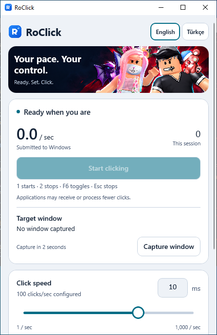

# RoClick

A local auto-clicker for **x64 Windows 10 22H2 and Windows 11**. Set your pace, capture a target window, and start or stop with a keyboard shortcut. A React Native Windows interface sits over a dedicated C++ input engine.

The app supports **English and Türkçe** with an instant, remembered language switch. The installed app works offline with its runtimes bundled. No Python or development server is required. No telemetry or automatic updates.

[**Download RoClick for Windows (.exe)**](https://github.com/0xMasharipov/RoClick/releases/latest/download/RoClick-Setup.exe)

Run `RoClick-Setup.exe`, install, and open RoClick from the Start menu. Everything needed to run the app is included; no Python, Node.js, or developer tools are required.

[Latest release and checksums](https://github.com/0xMasharipov/RoClick/releases/latest) · [Screenshots](#screenshots) · [Build from source](#build-on-windows) · [Validation](docs/VALIDATION.md)

**Windows 10/11 reference-machine validation is pending; 1,000 clicks/sec is not a validated guarantee.** See [validation status](docs/VALIDATION.md). Published Python releases remain available below.

## Screenshots

| Language | Light | Dark |
| --- | --- | --- |
| English |  |  |
| Türkçe |  |  |

[View the showcase sheet](docs/images/roclick-showcase.png) · [Editable showcase](docs/images/roclick-showcase.svg) · [Turkish narrow layout](docs/screenshots/roclick-tr-narrow.png) · [Turkish Advanced settings](docs/screenshots/roclick-tr-advanced.png)

These are actual installed-app captures from Windows CI, not generated interface mockups. The window scrolls to reveal additional controls at the runner's available desktop size. See [validation evidence](docs/VALIDATION.md) for the verified run and outstanding Windows 10/11 acceptance.

## Language

RoClick follows the first Windows preferred UI language on first launch: Turkish for Turkish Windows, English otherwise. Use **English / Türkçe** at the top of the app to switch immediately. Your explicit choice is saved per Windows user and survives restarts and reinstalling.

Controls, native errors, validation, screen-reader labels, and status announcements are localized. Switching languages keeps the current interval, mouse button, captured target, and running/paused state. Displayed numbers follow the language (`1,000.5` / `1.000,5`); interval and press-duration fields still accept ungrouped whole milliseconds.

The installer and this documentation remain in English. To return to automatic Windows-language selection, close RoClick and remove only the `Language` value under `HKEY_CURRENT_USER\Software\RoClick`.

## Use

1. Set an interval from **1–1,000 ms** (default **10 ms**, equivalent to 100 clicks/sec).
2. Select Left, Right, or Middle.
3. Choose **Capture window**, then focus the target within two seconds. Capture runs natively.
4. Position the pointer where clicks should land. Press **1** to start, **2** or **Escape** to stop, or **F6** to toggle.
5. With target focus lock enabled (the default), clicking pauses when the captured window loses focus and resumes when it regains focus. Closing it stops the engine and requires recapture.

The digit shortcuts pass through to the foreground app. Typing 1 in RoClick does not start clicking; 2, F6 and Escape remain global. Typing 2 into a field also stops clicking. The UI Start/Stop button is also available. Capture stops an active session. Settings apply on the native worker, releasing any current press before changing buttons or timing.

| Control | Action |
| --- | --- |
| **1** / numpad **1** | Start outside RoClick |
| **2** / numpad **2**, **Escape** | Stop globally |
| **F6** | Toggle globally |
| **Capture window** | Stop, then capture the window focused after two seconds |

### Download for Windows

1. [Download the latest Windows installer](https://github.com/0xMasharipov/RoClick/releases/latest/download/RoClick-Setup.exe) (x64 Windows 10 22H2 or Windows 11; no GitHub sign-in required).
2. Run `RoClick-Setup.exe` and follow the setup steps. Administrator privileges are not required.
3. Open **RoClick** from the Start menu.

The installer runs per user and bundles the production JavaScript, assets, and native runtimes for offline use. [SHA256SUMS.txt](https://github.com/0xMasharipov/RoClick/releases/latest/download/SHA256SUMS.txt) contains checksums for the installer and the separate benchmark tool. See the [latest release](https://github.com/0xMasharipov/RoClick/releases/latest) for release notes and all downloads. Older published Python executables are listed under [existing releases](#existing-published-releases).

For development builds, open [Build Windows installer](https://github.com/0xMasharipov/RoClick/actions/workflows/build-windows.yml), select a successful run on `main`, and download its **RoClick-Windows-x64** artifact (GitHub sign-in required). Extract the ZIP and run `RoClick-Setup.exe`.

**Speed means complete down/up clicks successfully submitted by `SendInput`.** The measured rate is a rolling native measurement, updated at most four times per second. It does not measure whether another app received or processed input. Target applications may process fewer clicks. **1,000 clicks/sec is a measured performance target, not a real-time guarantee.**

Advanced settings include focus lock, System/Light/Dark appearance, and press duration. **0 ms** submits down and up together for maximum speed. Longer presses reduce available speed and must be strictly below the interval. Rejected input stops clicking and displays a recovery message. RoClick never elevates itself automatically.

## Build on Windows

Requirements: x64 Windows, PowerShell 7, Node **22.14.0**, Visual Studio **2022** with Desktop development with C++, MSVC v143, Windows SDK **10.0.26100.0**, CMake, and Inno Setup **6.4.3**. RN **0.80.2**, RN Windows **0.80.6**, React **19.1.0**, and the dependency graph are pinned in `package.json` and `package-lock.json`.

```powershell
pwsh ./build.ps1
```

Output: `dist/RoClick-Setup.exe`, `dist/SHA256SUMS.txt`, and the separate `dist/roclick_benchmark.exe` validation tool. The installer bundles JavaScript/assets, Windows App SDK, RN, Hermes, and app-local MSVC runtime DLLs. It installs per user without requesting administrator privileges. Upgrade/reinstall uses a stable Inno AppId. Earlier portable releases are not deleted.

The **Build Windows installer** GitHub Actions workflow builds and uploads artifacts. It has read-only repository permissions and **does not create tags or publish releases**. Download the `RoClick-Windows-x64` artifact from its run. The diagnostics artifact contains the MSBuild binary log.

For development:

```powershell
npm ci
npm start
# Separate terminal:
npm run windows
```

For portable validation on Linux/macOS/Windows with a C++17 compiler:

```sh
npm run typecheck
npm run test:localization
npm run test:native
```

The Windows build separately compiles/tests the Win32 runtime. Linux tests use virtual time and simulated input; they are not Windows performance measurements.

## Design and architecture

Compact, resizable single window with a character-art header, navy surfaces in dark mode, cyan actions, system typography, keyboard focus visuals, and bilingual accessibility labels. Start/Stop and target capture appear before optional settings. Light/Dark/System modes and a scrolling layout support small windows; high contrast uses system colors and hides decorative artwork.

Native DWM Desktop Acrylic is requested on supported Windows 11 builds. Windows 10, unsupported builds, disabled transparency, high contrast, and remote sessions use a solid backdrop. See [architecture and API references](docs/ARCHITECTURE.md).

- `src/App.tsx`: React Native controls and presentation.
- `src/i18n.ts`: typed English/Turkish dictionaries and deterministic number formatting.
- `src/native/NativeAppSettings.ts`: native per-user language preference contract.
- `src/native/NativeClickEngine.ts`: typed TurboModule contract.
- `native/core/Engine.h`: deterministic scheduling/input state machine.
- `native/windows/Runtime.*`: dedicated worker, waitable timers, process/handle identity, global keyboard and destruction hooks.
- `windows/RoClick/`: RN Windows New Architecture desktop host and C++ TurboModule.
- `native/tests/`: virtual-time tests and independent-process local receiver benchmark.
- `installer/`, `scripts/`, `.github/workflows/`: offline installer, validation, and artifact preparation.

Brand assets: [vector app icon](assets/roclick-logo.svg) · [PNG app icon](assets/roclick-logo.png) · [Windows icon](assets/roclick.ico) · [banner source notes](docs/BRANDING.md).

## Existing published releases

v1.0.0 is the native Windows app with an offline installer. Versions v0.x use the previous Python implementation and remain available unchanged.

| Version | Windows EXE | SHA-256 |
| --- | --- | --- |
| **v1.0.0 (latest)** | [RoClick-Setup.exe](https://github.com/0xMasharipov/RoClick/releases/download/v1.0.0/RoClick-Setup.exe) | [SHA256SUMS.txt](https://github.com/0xMasharipov/RoClick/releases/download/v1.0.0/SHA256SUMS.txt) |
| v0.2.3 | [RoClick.exe](https://github.com/0xMasharipov/RoClick/releases/download/v0.2.3/RoClick.exe) | [RoClick.sha256.txt](https://github.com/0xMasharipov/RoClick/releases/download/v0.2.3/RoClick.sha256.txt) |
| v0.2.2 | [RoClick.exe](https://github.com/0xMasharipov/RoClick/releases/download/v0.2.2/RoClick.exe) | [RoClick.sha256.txt](https://github.com/0xMasharipov/RoClick/releases/download/v0.2.2/RoClick.sha256.txt) |
| v0.2.1 | [RoClick.exe](https://github.com/0xMasharipov/RoClick/releases/download/v0.2.1/RoClick.exe) | [RoClick.sha256.txt](https://github.com/0xMasharipov/RoClick/releases/download/v0.2.1/RoClick.sha256.txt) |
| v0.2.0 | [RoClick.exe](https://github.com/0xMasharipov/RoClick/releases/download/v0.2.0/RoClick.exe) | [RoClick.sha256.txt](https://github.com/0xMasharipov/RoClick/releases/download/v0.2.0/RoClick.sha256.txt) |
| v0.1.0 | [RoClick.exe](https://github.com/0xMasharipov/RoClick/releases/download/v0.1.0/RoClick.exe) | [RoClick.sha256.txt](https://github.com/0xMasharipov/RoClick/releases/download/v0.1.0/RoClick.sha256.txt) |

## License

MIT — see [LICENSE](LICENSE). Use on applications and systems you are authorized to automate.
